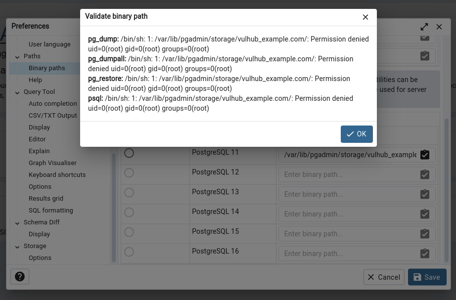

# pgAdmin <= 7.6 后台远程命令执行漏洞（CVE-2023-5002）

pgAdmin是一个著名的PostgreSQL数据库管理平台。

pgAdmin包含一个HTTP API可以用来让用户选择并验证额外的PostgreSQL套件，比如pg_dump和pg_restore。在[CVE-2022-4223](https://github.com/vulhub/vulhub/tree/master/pgadmin/CVE-2022-4223)中，这个API可被用于执行任意命令，官方对此进行了修复，但在7.6版本及以前修复并不完全，导致后台用户仍然可以执行任意命令。

参考链接：

- <https://github.com/pgadmin-org/pgadmin4/commit/35f05e49b3632a0a674b9b36535a7fe2d93dd0c2>
- <https://github.com/advisories/GHSA-ghp8-52vx-77j4>

## 漏洞环境

执行如下命令启动一个pgAdmin 7.6服务器：

```
docker compose up -d
```

服务器启动后，访问`http://your-ip:5050`即可查看到pgAdmin默认的登录页面。

**一些值得注意的事情**

CVE-2023-5002是一个针对[CVE-2022-4223](https://github.com/vulhub/vulhub/tree/master/pgadmin/CVE-2022-4223)漏洞的补丁绕过漏洞。官方发布了下面两个修复补丁修复漏洞：

- 给`validate_binary_path`函数增加`@login_required`装饰器，限制未授权的用户访问相关接口
- 使用`os.path.exists()`检查用户传入的路径是否有效

不幸地是，只有第二个修复补丁可以被绕过，所以该漏洞仅是一个后台命令执行漏洞。

## 漏洞复现

使用帐号`vulhub@example.com`和密码`vulhub`登录pgAdmin。

热爱后选择“Tools -> Storage Manager”打开文件管理器：


创建一个新的目录，名字是我们的Payload `";id;#`：


这个目录的完整路径是`/var/lib/pgadmin/storage/vulhub_example.com/";id;#`，我们后续就需要使用这个路径来利用漏洞。

选择“File -> Preferences”打开设置页面，并来到“Paths -> Binary paths”面板。在任意一个“PostgreSQL Binary Path”文本框中填入`/var/lib/pgadmin/storage/vulhub_example.com/";id;#`，并点击右侧的“验证”按钮：


可见，`id`命令被成功执行：


